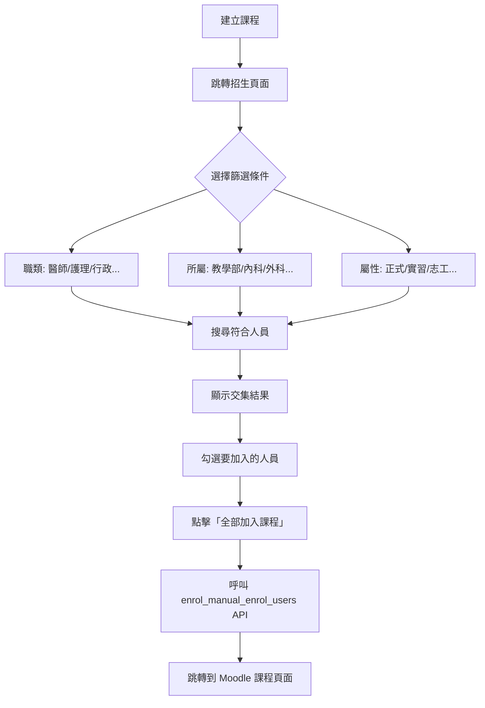

# 慈濟雲嘉線上學習平台 Portal 系統

## 系統概述

此系統是一個**醫療教育入口網站**，整合 Moodle 學習管理系統，為各院區提供統一的課程管理、人員分群、與招生功能。

---

## 核心功能

### 1. 🔐 單一登入 (SSO)
- 用戶透過 Portal 登入後自動同步 Moodle 帳號
- 支援多院區（台北、大林、嘉義等）
- 角色權限控管：管理員、院區管理員、一般用戶

### 2. 📚 課程管理
| 功能 | 說明 |
|------|------|
| 課程建立 | 複刻 Moodle 課程編輯介面，支援完整欄位 |
| 課程招生 | 依維度（職類、所屬、屬性）篩選人員並批次加入 |
| 課程列表 | 顯示院區內所有課程、可切換顯示/隱藏 |

### 3. 👥 群組管理（Cohort）
- 三維度分類系統：
  - **職類**：醫師、護理、行政人員...
  - **所屬**：教學部、內科、外科...
  - **屬性**：正式員工、實習生、志工...
- 支援批次新增/移除成員
- 從其他群組匯入成員

### 4. 📊 個人儀表板
- 顯示我的課程、學習進度
- 課程公告與最新消息
- 快速存取常用功能

---

## 技術架構

```
┌─────────────────────────────────────────────────────┐
│                   Portal 入口網站                    │
│  (PHP + JavaScript + MySQL)                         │
├─────────────────────────────────────────────────────┤
│                                                     │
│   ┌─────────────┐  ┌─────────────┐  ┌───────────┐   │
│   │ Landing Page│  │ Dashboard   │  │ Admin     │   │
│   │ 登入頁面    │  │ 儀表板      │  │ 管理介面  │   │
│   └─────────────┘  └─────────────┘  └───────────┘   │
│                                                     │
│   ┌─────────────────────────────────────────────┐   │
│   │              API Layer (REST)               │   │
│   │  manage_course.php | manage_cohort.php      │   │
│   │  manage_users.php  | ...                    │   │
│   └─────────────────────────────────────────────┘   │
│                         │                           │
└─────────────────────────┼───────────────────────────┘
                          │
                          ▼
┌─────────────────────────────────────────────────────┐
│                  Moodle LMS                         │
│              (Web Services API)                     │
│                                                     │
│   core_course_* | core_cohort_* | core_user_*       │
│   enrol_manual_enrol_users | ...                    │
└─────────────────────────────────────────────────────┘
```

---

## 檔案結構

```
htdocs/
├── index.php                    # 主入口
├── includes/
│   ├── config.php               # 資料庫與 Moodle 設定
│   ├── functions.php            # 共用函數 (call_moodle)
│   └── auth.php                 # 認證邏輯
├── api/hospital_admin/
│   ├── manage_course.php        # 課程 CRUD + 招生
│   ├── manage_cohort.php        # 群組 CRUD + 成員管理
│   └── manage_users.php         # 用戶管理
├── templates/
│   ├── landing.php              # 登入頁
│   ├── dashboard.php            # 儀表板
│   ├── header.php / footer.php
│   ├── hospital_admin_course_create_page.php   # 課程建立
│   ├── hospital_admin_course_enrol_page.php    # 課程招生
│   └── tabs/
│       ├── hospital_admin_cohorts.php          # 群組管理
│       └── hospital_admin_home.php             # 管理首頁
└── assets/
    └── css/                     # 樣式檔
```

---

## 主要 API 端點

### manage_course.php
| Action | Method | 說明 |
|--------|--------|------|
| `list` | GET | 取得課程列表 |
| `get` | GET | 取得單一課程 |
| `get_categories` | GET | 取得課程類別 |
| `create` | POST | 建立課程 |
| `update` | POST | 更新課程 |
| `delete` | POST | 刪除課程 |
| `enrol_users` | POST | 批次招生 |

### manage_cohort.php
| Action | Method | 說明 |
|--------|--------|------|
| `list` | GET | 取得群組列表 |
| `list_with_dimensions` | GET | 取得群組含維度分類 |
| `get_users` | GET | 搜尋可用用戶 |
| `get_common_members` | POST | 取得多群組交集成員 |
| `create` | POST | 建立群組 |
| `add_members` | POST | 批次加入成員 |
| `remove_members` | POST | 批次移除成員 |

---

## 課程招生流程



---

## 資料庫表格

### Portal 自有表格
- `users` - 用戶基本資料
- `institutions` - 院區設定（含 management_category_id）
- `cohort_dimensions` - 群組維度對應
- `dimension_types` - 維度類型（職類、所屬、屬性）

### Moodle 表格（透過 API 操作）
- `mdl_course` - 課程
- `mdl_cohort` - 群組
- `mdl_cohort_members` - 群組成員
- `mdl_user_enrolments` - 課程選課

---

## 維護者注意事項

1. **Moodle Token 權限**  
   需確保 Web Service Token 有以下函數權限：
   - `core_course_create_courses`
   - `core_cohort_add_cohort_members`
   - `core_user_get_users`
   - `enrol_manual_enrol_users`

2. **院區對應**  
   `institutions.management_category_id` 需對應正確的 Moodle 課程分類 ID

3. **群組維度**  
   新增群組後需在 `cohort_dimensions` 表設定維度類型
