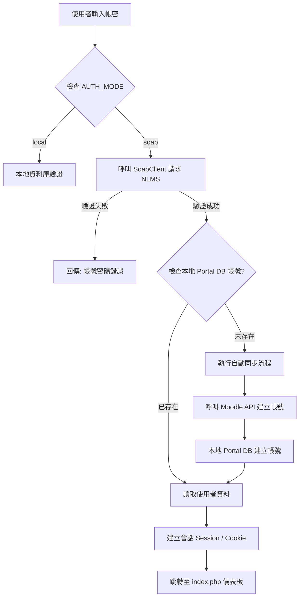

# 雲嘉學習網：SOAP 混合驗證登入流程說明

本文檔詳細說明了「入口網站」目前的 SOAP 整合驗證邏輯，包含如何與 NLMS 主機對接、如何自動同步 Moodle 帳號，以及 Session 的管理機制。

---

## 1. 流程概覽 (Sequence)

當使用者在登入頁面輸入帳號密碼並按下「登入」後，系統會執行以下檢核：

---

## 2. 詳細步驟說明

### 第一階段：遠端主機驗證 (SOAP Handshake)
*   **傳輸參數**：系統會將使用者輸入的 `username` 與 **MD5 雜湊後**的 `password` 傳送至 NLMS SOAP 端點。
*   **安全處理**：考慮到部分伺服器環境，連線時已設定 `stream_context` 略過 SSL 憑證驗證（`verify_peer: false`），確保內部網路通訊順暢。

### 第二階段：帳號自動同步 (Auto-Sync Logic)
如果遠端驗證成功，但「入口網站資料庫」找不到該使用者，系統會判定為**首次登入**，並觸發以下同步動作：

1.  **Moodle 帳號同步**：
    *   **策略**：為了避免 Moodle 端的密碼複雜度原則（例如：必須有大寫+符號）與 NLMS 密碼產生衝突，系統會產生一組**絕對符合規則的「強隨機密碼」**傳送給 Moodle API。
    *   **API 呼叫**：使用 `core_user_create_users` 功能。
    *   **備註**：Moodle 端存儲的密碼並不影響 SSO 登入，因為 SSO 是基於使用者名稱進行對接的。

2.  **本地 Portal 同步**：
    *   在 `portal_db.users` 新增紀錄。
    *   **權限設定**：預設角色一律設為 `student`（學員）。
    *   **資料保留**：保留從 SOAP 抓回來的 `sn` (全名) 作為顯示姓名。

### 第三階段：會話建立與加密 (Session & Security)
登入成功後，系統會派發以下資訊：
*   **`$_SESSION['username']`**：使用者帳號（統一轉換為小寫存儲）。
*   **`$_SESSION['moodle_token']`**：這是一個**關鍵安全設計**。
    *   系統會將使用者登入時輸入的「原始密碼」進行 **AES-256 加密**後存放在 Session 中。
    *   *用途*：當使用者之後從首頁點擊「進入 Moodle」時，系統需要這組密碼來加密產生 SSO Token，讓 Moodle 驗證身分。
*   **Cookies**：設定 `portal_is_admin` 與 `portal_is_teacherplus` 旗標，供 Moodle 前端主題切換 UI 顯示。

---

## 3. 設定方式 (Configuration)

開發者可隨時透過修改 `includes/config.php` 來切換驗證模式：

| 模式 | 設定值 | 說明 |
| :--- | :--- | :--- |
| **本地模式** | `define('AUTH_MODE', 'local');` | 使用資料庫 `users` 表格內的密碼驗證（測試用）。 |
| **混合模式** | `define('AUTH_MODE', 'soap');` | 優先使用遠端 SOAP 驗證，成功後再自動同步本地資料。 |

---

## 4. 常見問題 (Troubleshooting)

*   **Q: 為什麼 SOAP 登入後 Moodle 課程是空的？**
    *   A: 通常是因為該使用者在「同步功能實作前」就已經存在於 Portal 資料庫，導致系統跳過了「API 開戶」步驟。您可以手動從 `users` 表刪除該帳號後重新登入即可解決。
*   **Q: SOAP 登入時的大小寫有差別嗎？**
    *   A: 沒有。系統已強化為**強制轉換小寫**（Lowercase Conversion），確保與 Moodle 的帳號規範 100% 契合。
