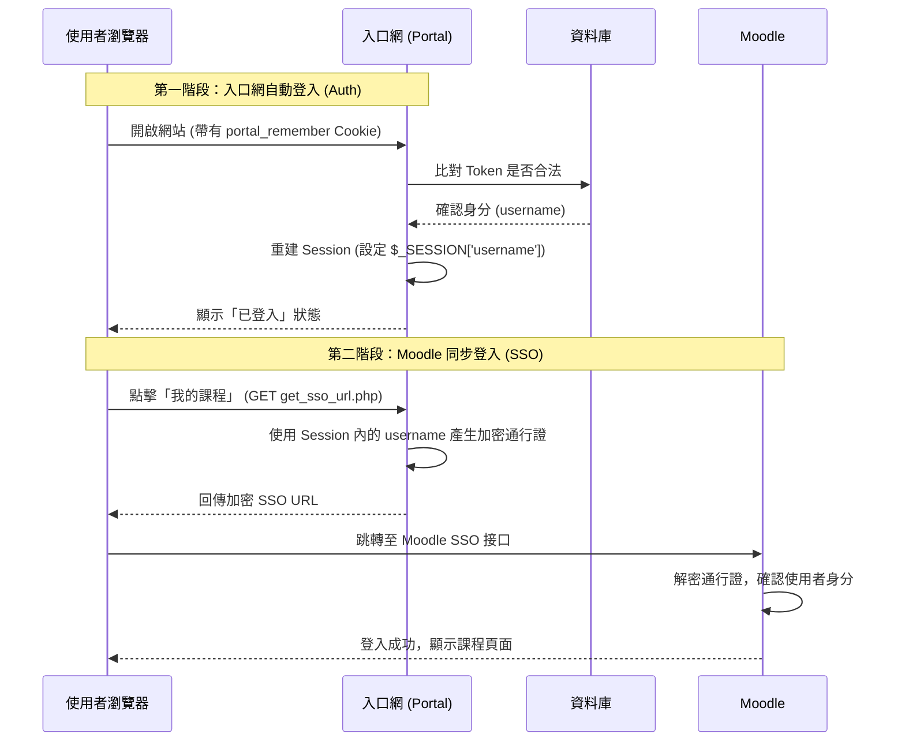

# 自動登入與 Moodle SSO 運作機制說明

本專案實作了一套「一處登入，全站通行」的機制。當使用者勾選「記住我」後，不僅入口網會自動登入，進入 Moodle 時也會透過 SSO 機制自動同步身分。

## 1. 運作流程圖

## 2. 詳細技術原理

### 第一階段：入口網的身分恢復 (Persistence)
1. **Cookie 儲存**：使用者登入時勾選「記住我」，入口網會在瀏覽器存入 `portal_remember` Cookie，並在資料庫存入對應的隨機 Token（有效期限 30 天）。
2. **自動觸發**：每當使用者造訪頁面，`auth.php` 中的 `check_auto_login()` 會被呼叫。
3. **身分重建**：如果 Token 匹配，系統會根據資料庫資料重新填入 `$_SESSION`。這解決了「瀏覽器關閉後 Session 消失」的問題。

### 第二階段：Moodle 的信任傳遞 (SSO)
這是入口網自動登入後，**最關鍵的操作**：
1. **隨選登入**：我們並不要求 Moodle 也要存 30 天的 Cookie。相反地，我們利用「入口網已經知道你是誰」這點。
2. **動態產生通行證**：當使用者點選任何進入 Moodle 的按鈕時，入口網會跑一次 `get_sso_url.php`，利用目前已恢復的 Session 產生一個**限時 5 分鐘有效**、經 AES 加密的加密字串（包含你的 username）。
3. **無縫對接**：瀏覽器帶著這個通行證跳轉到 Moodle，Moodle 解密後發現是來自入口網的合法請求，就會立刻在 Moodle 端開啟一個 Moodle 的 Session。

## 3. 相關程式碼
*   **入口網自動登入**：`includes/auth.php` -> `check_auto_login()`
*   **SSO 產生器**：`get_sso_url.php`
*   **Moodle 加密金鑰設定**：`includes/config.php` 中的 `$moodle_sso_secret`
