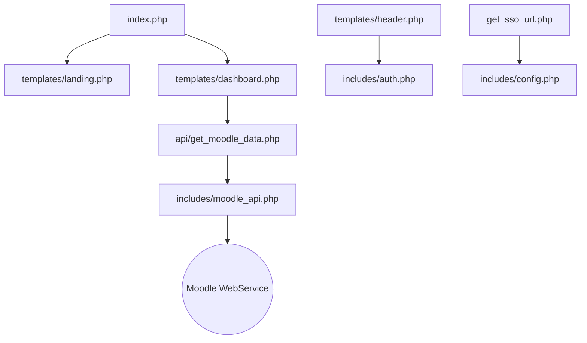

# 學習網專案架構說明文件 (Project Architecture)

本專案是一個集成了 **Moodle 數位學習系統** 的自訂入口網平台。它作為一個入口門戶 (Portal)，提供了精緻的介面、統一的身分驗證 (SSO) 以及整合式的學習數據儀表板。

---

## 1. 系統整體架構 (System Overview)

本專案採用 **PHP + MySQL + Moodle API** 的架構實作，主要分為兩個大型區塊：
1.  **入口網門戶 (The Portal)**：負責使用者吸引、註冊、登入及個人數據展示。
2.  **學習系統 (Moodle)**：負責實際的課程內容、測驗及成績管理。

---

## 2. 目錄結構與功能詳解

### 📂 根目錄 (Root)
*   `index.php`：專案進入點。自動判斷使用者登入狀態，跳轉至「首頁」或「儀表板」。
*   `register.php` / `logout.php` / `change_password.php`：身分管理相關功能頁面。
*   `get_sso_url.php`：**核心組件**。負責產生進入 Moodle 的加密安全通行證 (SSO Token)。

### 📂 `includes/` - 核心邏輯層
這裡存放系統的「大腦」，不包含展示介面：
*   `config.php`：資料庫連線資訊、Moodle API 金鑰、SSO 共享金鑰等全域設定。
*   `auth.php`：登入驗證、CSRF 防護、**「記住我」(Auto Login)** 功能的實作。
*   `moodle_api.php`：專門處理與 Moodle Web Services 通訊的函數封裝，用來抓取課程與成績。
*   `functions.php`：通用工具函數。

### 📂 `templates/` - 介面展示層
負責網頁的 HTML 骨架：
*   `landing.php`：訪客看到的「入口首頁」，包含吸引人的視覺特效 (Hero Section)。
*   `dashboard.php`：登入後的「個人儀表板」，展示使用者的學習進度、代辦事項等。
*   `async_loader.php`：**效能優化組件**。負責非同步地從 Moodle 抓取數據，避免頁面載入時卡頓。
*   `header.php` / `footer.php`：導覽列、頁尾與全站共用的 JS/CSS 載入。

### 📂 `api/` - 後端接口層
*   `get_moodle_data.php`：提供給儀表板前端呼叫的 JSON 接口，負責獲取課程與成績數據。

### 📂 `assets/` - 靜態資源層
*   `css/`：包含 `style.css` (全局裝飾)、`landing.css` (首頁特效) 及 Moodle 專用主題樣式。
*   `js/`：`main.js` (入口網互動邏輯) 與 `moodle-custom-integration.js` (Moodle 端的自訂選單整合)。
*   `moodle-inject/`：存放需要「注入」到 Moodle 系統設定中的指令稿（如自訂導覽列）。

### 📂 `docs/` - 說明手冊
*   `SSO_IMPLEMENTATION.md`：詳解單一登入技術細節。
*   `AUTO_LOGIN_SSO.md`：解說自動登入與 Moodle 權限同步的機制。

---

## 3. 核心技術流程

### A. 身分驗證鏈 (Chain of Trust)
1.  使用者在 **Portal** 登入。
2.  Portal 寫入加密 Cookie 至瀏覽器。
3.  進入 **Moodle** 時，Portal 產生一個短時效的加密權杖 (Token)。
4.  Moodle 解密後自動為使用者建立對應身分，完成免密碼登入。

### B. 數據整合 (Data Integration)
1.  儀表板在瀏覽器端發起 AJAX 請求。
2.  `get_moodle_data.php` 透過後端 API 與 Moodle 資料庫或 Web Service 溝通。
3.  結果以 JSON 回傳並動態渲染圓餅圖或課程卡片，實現「人在 Portal，看得到 Moodle 內容」的效果。

---

## 4. 檔案關聯圖

---
*本文件由系統自動產生，最後更新於 2025-12-19*
